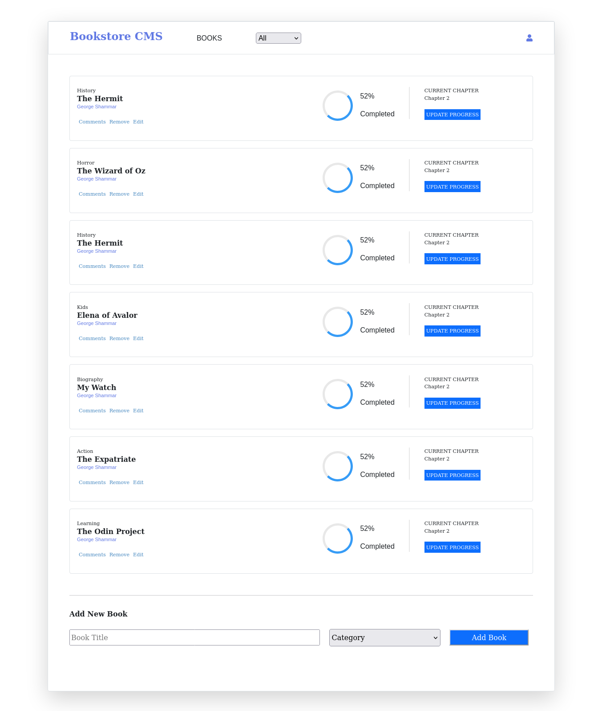

# bookstore-cmss

This is a bookstore application built with React and Redux. It gives a user the opportunity 
to add their books of choice in different categories. Users are also able to filter specific books based on categories. Specific books can also be deleted from the store. This project demonstrates how Redux can be used to manage complex states in a React application.



## Built With
- React
- JavaScript
- HTML
- CSS
- Redux

## Tools
- PropTypes

## Live Demo
[Deployed app](https://bookstore-cmss.herokuapp.com/)

## Getting Started

To run a local copy of this application, follow the steps below:

- Go to the "Code" section of this repository and press the green button that says "Code". Copy the URL or the SSH key.
- Go to the terminal and enter:
```
git clone URL/SSH key
```

The URL or SSH are the links copied from the step above.

- If you don't have git installed, you can download this project and unzip it.
- Change directory into the folder the application is saved.
```
cd directory
```
Directory is the name of your folder.

- Once you have the local copy in your desired folder, go back to your terminal and run:
```
npm install
```
This command installs all the dependencies of the application. Once you complete all installations successfully, you're ready to use the application.

- To start using the application, run:
```
npm start
```
- The Bookstore application will open up in your browser.

## Developer

👤 **George Gbenle**

- GitHub: [george-shammar](https://github.com/george-shammar)
- Twitter: [@GeorgeShammar](https://twitter.com/GeorgeShammar)
- LinkedIn: [George Gbenle](https://www.linkedin.com/in/georgegbenle/)

## 🤝 Contributing

Contributions, issues and feature requests are welcome!

## Show your support

Give a ⭐️ if you like this project!

## 📝 License

This project is [MIT](LICENSE) licensed.
